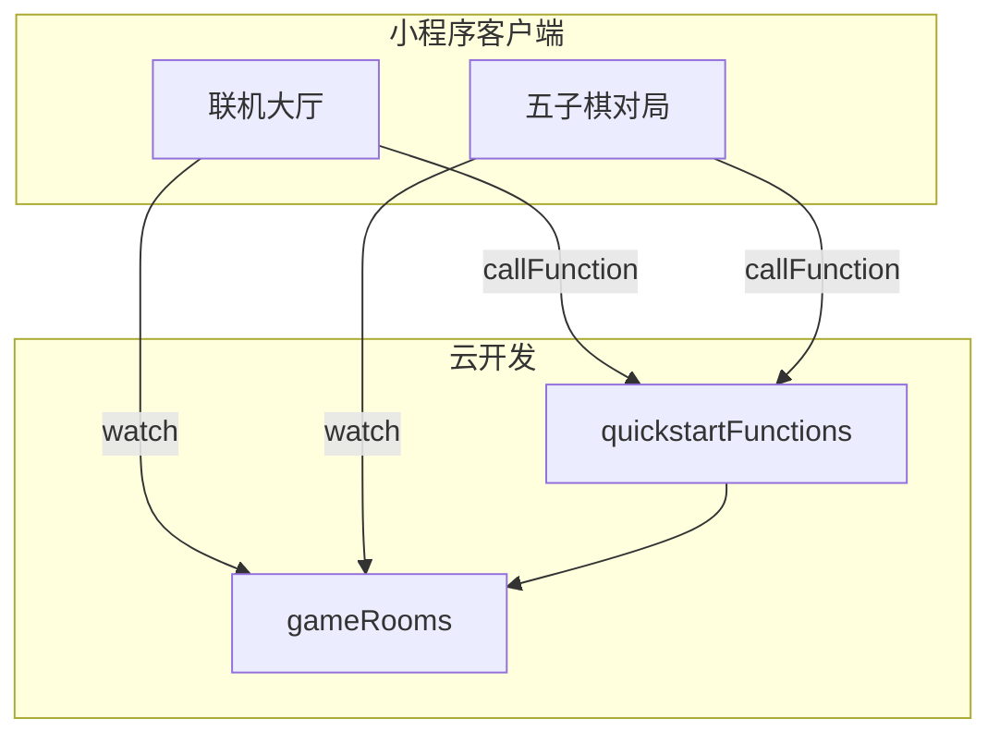
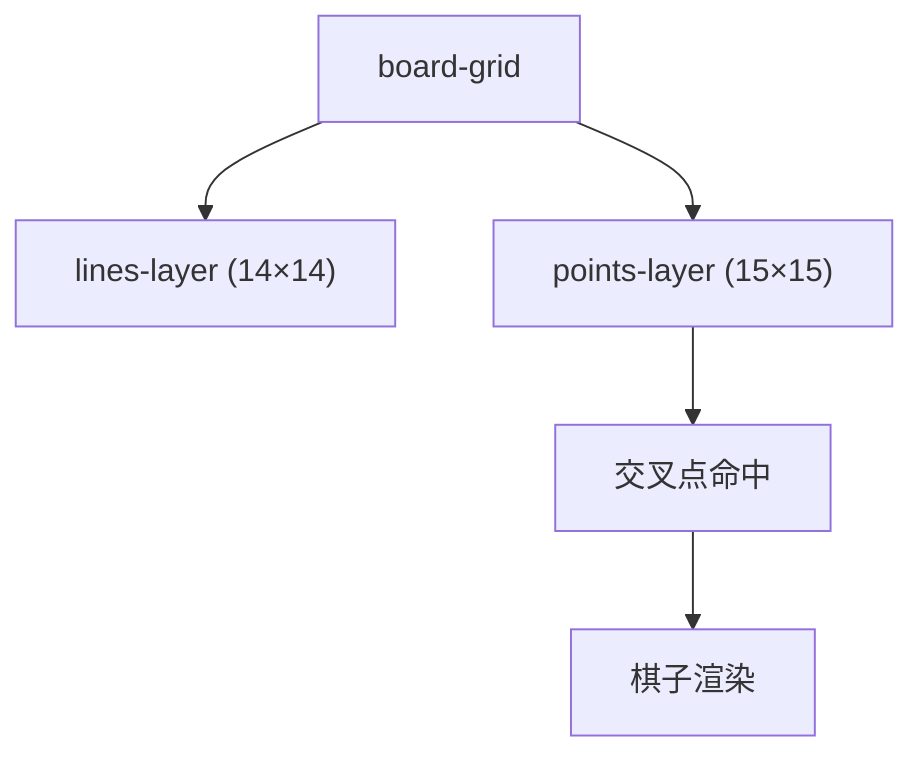
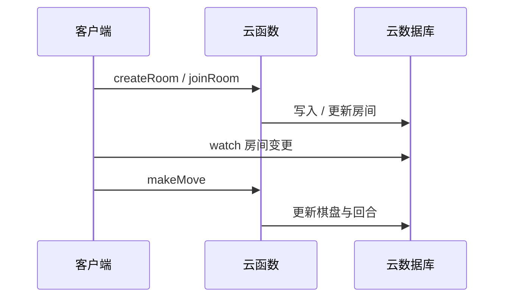
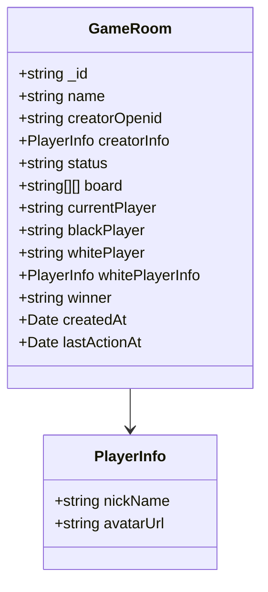

# 系统架构

## 执行摘要
本系统采用“小程序客户端 + 云函数 + 云数据库”的轻量全栈架构。客户端负责 UI 与交互流程，云函数作为后端网关封装核心业务逻辑，云数据库承担房间与棋盘状态的持久化与实时同步。

对局页面使用 15×15 交叉点落子模型（14×14 格）。棋盘线由独立的线层渲染，棋子落在交叉点层，保证视觉与交互的一致性。

**Section sources**
- [miniprogram/pages/gomoku/index.js](file:///D:/WeChatProjects/miniprogram-1/miniprogram/pages/gomoku/index.js#L1-L260)
- [miniprogram/pages/gomoku/index.wxml](file:///D:/WeChatProjects/miniprogram-1/miniprogram/pages/gomoku/index.wxml#L1-L70)
- [miniprogram/pages/gomoku/index.wxss](file:///D:/WeChatProjects/miniprogram-1/miniprogram/pages/gomoku/index.wxss#L150-L330)

## 系统架构图

**Diagram sources**
- [miniprogram/pages/online/index.js](file:///D:/WeChatProjects/miniprogram-1/miniprogram/pages/online/index.js#L51-L120)
- [miniprogram/pages/gomoku/index.js](file:///D:/WeChatProjects/miniprogram-1/miniprogram/pages/gomoku/index.js#L1-L260)
- [cloudfunctions/quickstartFunctions/index.js](file:///D:/WeChatProjects/miniprogram-1/cloudfunctions/quickstartFunctions/index.js#L1-L700)

## 技术栈与版本
| 组件 | 版本/配置 | 选择理由 |
| --- | --- | --- |
| 小程序基础库 | 2.20.1 | 与项目配置保持一致 |
| 云函数 SDK | wx-server-sdk ~2.4.0 | 官方 SDK，支持数据库与 OpenAPI |
| 编译设置 | ES6、压缩 WXML/WXSS | 兼顾可读性与体积 |

**Section sources**
- [project.config.json](file:///D:/WeChatProjects/miniprogram-1/project.config.json#L1-L85)
- [cloudfunctions/quickstartFunctions/package.json](file:///D:/WeChatProjects/miniprogram-1/cloudfunctions/quickstartFunctions/package.json#L1-L14)

## 棋盘渲染层设计

**Diagram sources**
- [miniprogram/pages/gomoku/index.wxml](file:///D:/WeChatProjects/miniprogram-1/miniprogram/pages/gomoku/index.wxml#L1-L70)
- [miniprogram/pages/gomoku/index.wxss](file:///D:/WeChatProjects/miniprogram-1/miniprogram/pages/gomoku/index.wxss#L150-L330)

## 数据流（联机对局）

**Diagram sources**
- [cloudfunctions/quickstartFunctions/index.js](file:///D:/WeChatProjects/miniprogram-1/cloudfunctions/quickstartFunctions/index.js#L160-L560)

## 数据模型

**Diagram sources**
- [cloudfunctions/quickstartFunctions/index.js](file:///D:/WeChatProjects/miniprogram-1/cloudfunctions/quickstartFunctions/index.js#L160-L260)

## 音效机制
对局页创建两个音效实例：自己落子使用 `place.wav`，对手落子使用 `place-opponent.wav`，保证对局反馈更清晰。

**Section sources**
- [miniprogram/pages/gomoku/index.js](file:///D:/WeChatProjects/miniprogram-1/miniprogram/pages/gomoku/index.js#L1-L260)
- [miniprogram/assets/sounds/place.wav](file:///D:/WeChatProjects/miniprogram-1/miniprogram/assets/sounds/place.wav#L1-L1)
- [miniprogram/assets/sounds/place-opponent.wav](file:///D:/WeChatProjects/miniprogram-1/miniprogram/assets/sounds/place-opponent.wav#L1-L1)

## 相关文档
- [项目首页](index.md)
- [快速开始](getting-started.md)
- [文档关系图](doc-map.md)

**Section sources**
- [project.config.json](file:///D:/WeChatProjects/miniprogram-1/project.config.json#L1-L85)

*由 [Mini-Wiki v3.0.6](https://github.com/trsoliu/mini-wiki) 自动生成 | 2026-01-31T22:09:13.0084447+08:00*