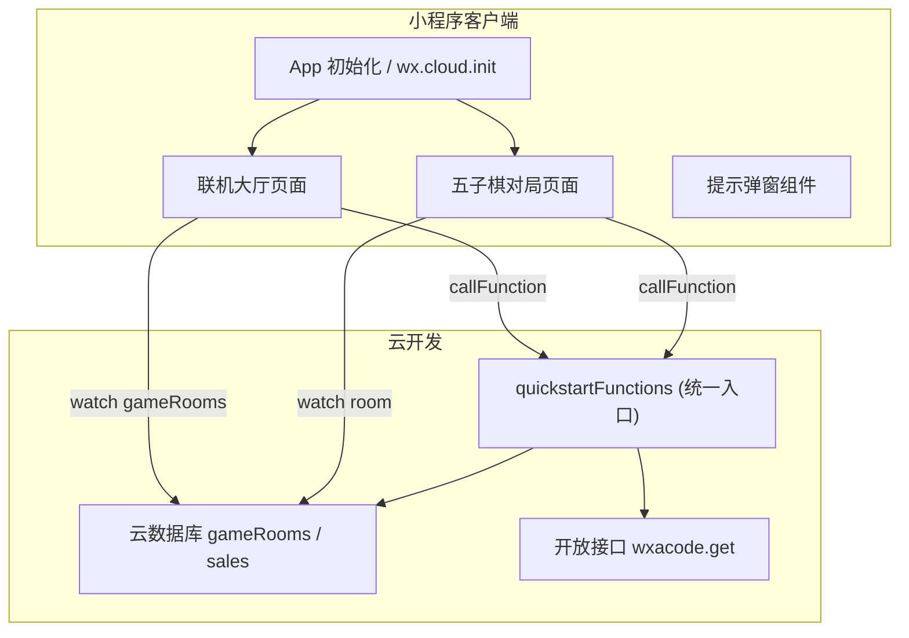
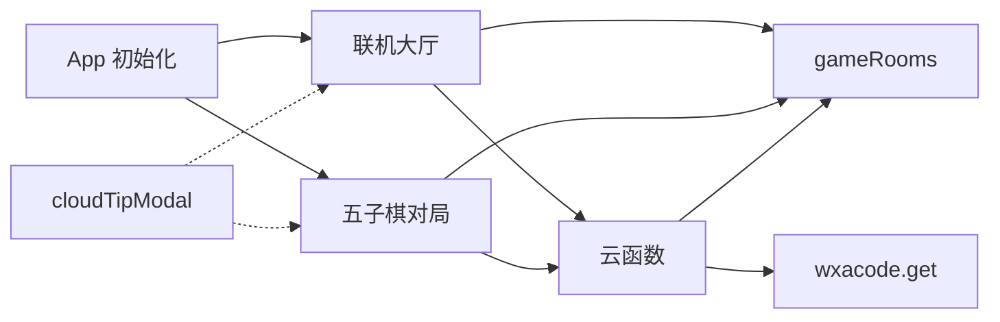
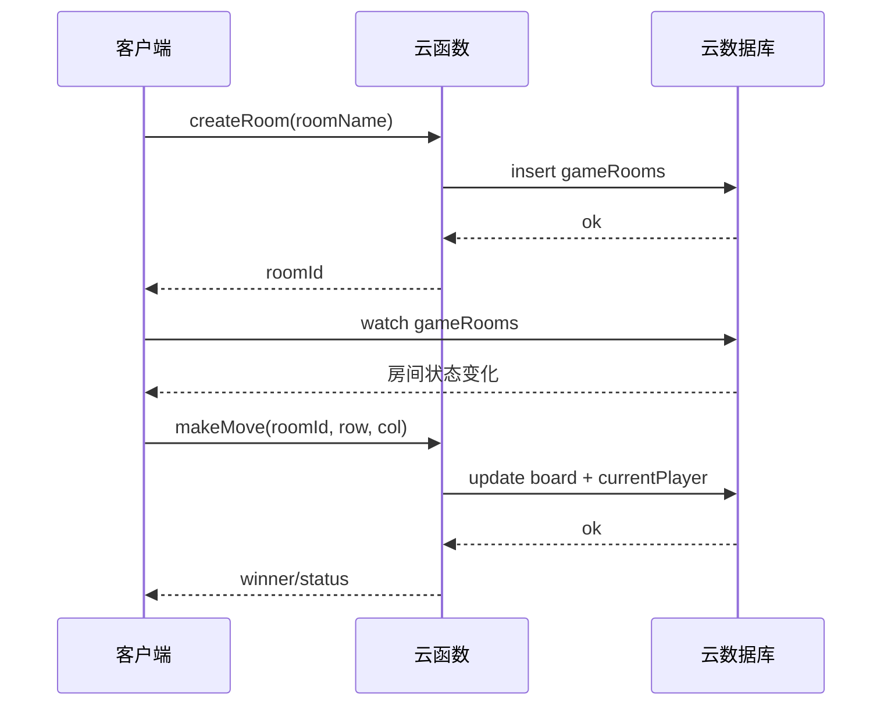
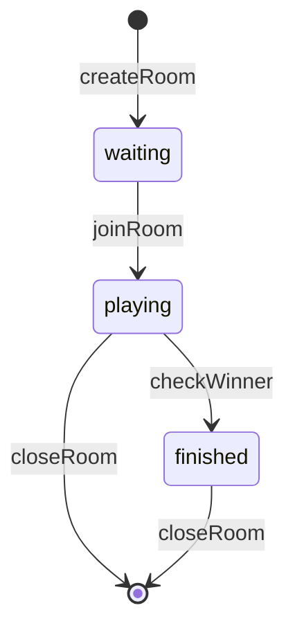
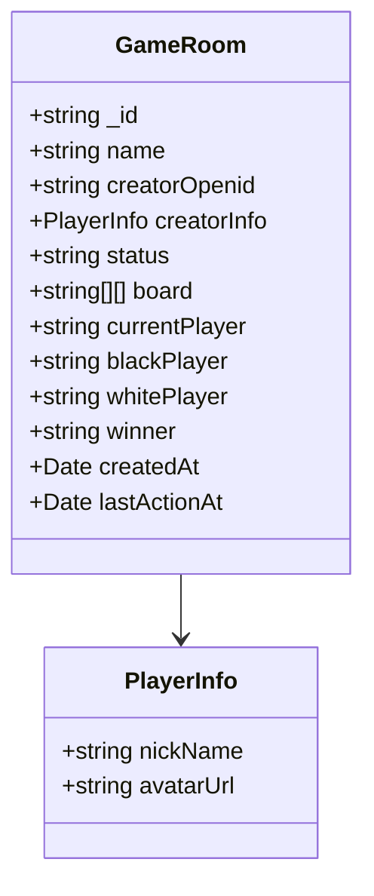

# 系统架构

## 执行摘要
本系统采用“小程序客户端 + 云函数 + 云数据库”的轻量全栈架构。客户端负责 UI 与交互流程，云函数作为后端网关封装核心业务逻辑，云数据库承担房间与棋盘状态的持久化与实时同步。

架构的关键在于将对局流程拆分为：客户端触发操作、云函数校验与写入、客户端监听变更与 UI 更新。为保障联机体验，客户端启用数据库 `watch` 监听，并在监听异常时进行重试，以保持对局状态的一致性。

**Section sources**
- [miniprogram/app.js](file:///D:/WeChatProjects/miniprogram-1/miniprogram/app.js#L1-L16)
- [miniprogram/pages/online/index.js](file:///D:/WeChatProjects/miniprogram-1/miniprogram/pages/online/index.js#L85-L111)
- [miniprogram/pages/gomoku/index.js](file:///D:/WeChatProjects/miniprogram-1/miniprogram/pages/gomoku/index.js#L108-L139)
- [cloudfunctions/quickstartFunctions/index.js](file:///D:/WeChatProjects/miniprogram-1/cloudfunctions/quickstartFunctions/index.js#L165-L523)

## 系统架构图

**Diagram sources**
- [miniprogram/app.js](file:///D:/WeChatProjects/miniprogram-1/miniprogram/app.js#L1-L16)
- [miniprogram/pages/online/index.js](file:///D:/WeChatProjects/miniprogram-1/miniprogram/pages/online/index.js#L51-L111)
- [miniprogram/pages/gomoku/index.js](file:///D:/WeChatProjects/miniprogram-1/miniprogram/pages/gomoku/index.js#L108-L139)
- [cloudfunctions/quickstartFunctions/index.js](file:///D:/WeChatProjects/miniprogram-1/cloudfunctions/quickstartFunctions/index.js#L18-L559)
- [cloudfunctions/quickstartFunctions/config.json](file:///D:/WeChatProjects/miniprogram-1/cloudfunctions/quickstartFunctions/config.json#L1-L7)

**Section sources**
- [miniprogram/app.js](file:///D:/WeChatProjects/miniprogram-1/miniprogram/app.js#L1-L16)
- [miniprogram/pages/online/index.js](file:///D:/WeChatProjects/miniprogram-1/miniprogram/pages/online/index.js#L51-L111)
- [miniprogram/pages/gomoku/index.js](file:///D:/WeChatProjects/miniprogram-1/miniprogram/pages/gomoku/index.js#L108-L139)
- [cloudfunctions/quickstartFunctions/index.js](file:///D:/WeChatProjects/miniprogram-1/cloudfunctions/quickstartFunctions/index.js#L18-L559)
- [cloudfunctions/quickstartFunctions/config.json](file:///D:/WeChatProjects/miniprogram-1/cloudfunctions/quickstartFunctions/config.json#L1-L7)

## 技术栈与版本
| 组件 | 版本/配置 | 选择理由 |
| --- | --- | --- |
| 小程序基础库 | 2.20.1 | 与项目配置保持一致，兼容云开发能力 |
| 云函数 SDK | wx-server-sdk ~2.4.0 | 官方 SDK，支持数据库与 OpenAPI |
| 编译设置 | ES6、压缩 WXML/WXSS | 兼顾可读性与发布体积 |
| 云环境选择 | `cloud.DYNAMIC_CURRENT_ENV` | 自动适配当前环境 |
| OpenAPI 权限 | wxacode.get | 生成小程序码 |

**Section sources**
- [project.config.json](file:///D:/WeChatProjects/miniprogram-1/project.config.json#L1-L85)
- [cloudfunctions/quickstartFunctions/package.json](file:///D:/WeChatProjects/miniprogram-1/cloudfunctions/quickstartFunctions/package.json#L1-L14)
- [cloudfunctions/quickstartFunctions/index.js](file:///D:/WeChatProjects/miniprogram-1/cloudfunctions/quickstartFunctions/index.js#L1-L28)
- [cloudfunctions/quickstartFunctions/config.json](file:///D:/WeChatProjects/miniprogram-1/cloudfunctions/quickstartFunctions/config.json#L1-L7)

## 模块依赖关系

**Diagram sources**
- [miniprogram/app.js](file:///D:/WeChatProjects/miniprogram-1/miniprogram/app.js#L1-L16)
- [miniprogram/pages/online/index.js](file:///D:/WeChatProjects/miniprogram-1/miniprogram/pages/online/index.js#L51-L111)
- [miniprogram/pages/gomoku/index.js](file:///D:/WeChatProjects/miniprogram-1/miniprogram/pages/gomoku/index.js#L108-L139)
- [cloudfunctions/quickstartFunctions/index.js](file:///D:/WeChatProjects/miniprogram-1/cloudfunctions/quickstartFunctions/index.js#L18-L559)
- [cloudfunctions/quickstartFunctions/config.json](file:///D:/WeChatProjects/miniprogram-1/cloudfunctions/quickstartFunctions/config.json#L1-L7)

**Section sources**
- [miniprogram/pages/online/index.js](file:///D:/WeChatProjects/miniprogram-1/miniprogram/pages/online/index.js#L51-L111)
- [miniprogram/pages/gomoku/index.js](file:///D:/WeChatProjects/miniprogram-1/miniprogram/pages/gomoku/index.js#L108-L139)
- [cloudfunctions/quickstartFunctions/index.js](file:///D:/WeChatProjects/miniprogram-1/cloudfunctions/quickstartFunctions/index.js#L165-L559)

## 数据流（联机对局）

**Diagram sources**
- [miniprogram/pages/online/index.js](file:///D:/WeChatProjects/miniprogram-1/miniprogram/pages/online/index.js#L85-L111)
- [miniprogram/pages/gomoku/index.js](file:///D:/WeChatProjects/miniprogram-1/miniprogram/pages/gomoku/index.js#L268-L331)
- [cloudfunctions/quickstartFunctions/index.js](file:///D:/WeChatProjects/miniprogram-1/cloudfunctions/quickstartFunctions/index.js#L165-L345)

**Section sources**
- [miniprogram/pages/online/index.js](file:///D:/WeChatProjects/miniprogram-1/miniprogram/pages/online/index.js#L85-L111)
- [miniprogram/pages/gomoku/index.js](file:///D:/WeChatProjects/miniprogram-1/miniprogram/pages/gomoku/index.js#L268-L331)
- [cloudfunctions/quickstartFunctions/index.js](file:///D:/WeChatProjects/miniprogram-1/cloudfunctions/quickstartFunctions/index.js#L165-L345)

## 状态管理（房间生命周期）

**Diagram sources**
- [cloudfunctions/quickstartFunctions/index.js](file:///D:/WeChatProjects/miniprogram-1/cloudfunctions/quickstartFunctions/index.js#L165-L523)

**Section sources**
- [cloudfunctions/quickstartFunctions/index.js](file:///D:/WeChatProjects/miniprogram-1/cloudfunctions/quickstartFunctions/index.js#L165-L523)

## 数据模型

**Diagram sources**
- [cloudfunctions/quickstartFunctions/index.js](file:///D:/WeChatProjects/miniprogram-1/cloudfunctions/quickstartFunctions/index.js#L165-L190)

**Section sources**
- [cloudfunctions/quickstartFunctions/index.js](file:///D:/WeChatProjects/miniprogram-1/cloudfunctions/quickstartFunctions/index.js#L165-L190)

## 目录结构
```
miniprogram/
  app.js
  app.json
  app.wxss
  pages/
    online/
    gomoku/
  components/
    cloudTipModal/
cloudfunctions/
  quickstartFunctions/
    index.js
    package.json
    config.json
```

**Section sources**
- [project.config.json](file:///D:/WeChatProjects/miniprogram-1/project.config.json#L1-L85)

## 设计原则与模式
- 云函数统一入口：通过 `event.type` 进行路由，简化前端调用面。
- 客户端轻量逻辑：本地模式独立运行，联机模式依赖云端状态。
- 乐观更新与回滚：联机落子先更新 UI，失败后回退。
- 监听 + 重试：实时监听异常时进行重连，保证房间列表与对局同步。

**Section sources**
- [cloudfunctions/quickstartFunctions/index.js](file:///D:/WeChatProjects/miniprogram-1/cloudfunctions/quickstartFunctions/index.js#L525-L558)
- [miniprogram/pages/gomoku/index.js](file:///D:/WeChatProjects/miniprogram-1/miniprogram/pages/gomoku/index.js#L268-L331)
- [miniprogram/pages/online/index.js](file:///D:/WeChatProjects/miniprogram-1/miniprogram/pages/online/index.js#L85-L111)

## 安全与权限
- 使用 `OPENID` 识别玩家身份与回合权限。
- 加入房间时阻止房主重复加入。
- 关闭房间需校验参与者身份。

**Section sources**
- [cloudfunctions/quickstartFunctions/index.js](file:///D:/WeChatProjects/miniprogram-1/cloudfunctions/quickstartFunctions/index.js#L232-L523)

## 性能与可用性
为减少联机对局数据量，客户端在收到房间更新时优先差分更新棋盘，只有变化较大时才整体替换，以降低 `setData` 成本。

### 局部棋盘更新 [📄](file:///D:/WeChatProjects/miniprogram-1/miniprogram/pages/gomoku/index.js#L175-L211)
```javascript
const changes = [];
for (let r = 0; r < nextBoard.length; r++) {
  for (let c = 0; c < nextBoard[r].length; c++) {
    if (nextBoard[r][c] !== curRow[c]) {
      changes.push({ r, c });
      if (changes.length > 3) break;
    }
  }
}
// 变更较少时使用 board[r][c] 进行细粒度更新
```

**Section sources**
- [miniprogram/pages/gomoku/index.js](file:///D:/WeChatProjects/miniprogram-1/miniprogram/pages/gomoku/index.js#L175-L211)

## 扩展指南
- 增加观战模式：在 `gameRooms` 中添加 `spectators` 字段并扩展订阅逻辑。
- 增加聊天功能：新增 `roomMessages` 集合，与房间 ID 关联。
- 对局统计：在云函数中写入胜负与回合数据，便于排行榜展示。

**Section sources**
- [cloudfunctions/quickstartFunctions/index.js](file:///D:/WeChatProjects/miniprogram-1/cloudfunctions/quickstartFunctions/index.js#L165-L523)

## 相关文档
- [项目首页](index.md)
- [快速开始](getting-started.md)
- [文档关系图](doc-map.md)

**Section sources**
- [project.config.json](file:///D:/WeChatProjects/miniprogram-1/project.config.json#L1-L85)

*由 [Mini-Wiki v3.0.6](https://github.com/trsoliu/mini-wiki) 自动生成 | 2026-01-31T17:19:38.0847103+08:00*
