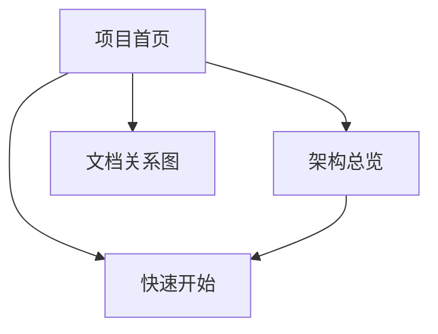

# 文档关系图

## 关系图谱

**Diagram sources**
- [project.config.json](file:///D:/WeChatProjects/miniprogram-1/project.config.json#L1-L85)

## 阅读路径建议
| 角色 | 建议路径 |
| --- | --- |
| 新成员 | 快速开始 → 架构总览 → 项目首页 |
| 架构评审 | 架构总览 → 项目首页 |
| 功能改造 | 项目首页 → 架构总览 |

## 文档索引
- [项目首页](index.md)
- [架构总览](architecture.md)
- [快速开始](getting-started.md)

*由 [Mini-Wiki v3.0.6](https://github.com/trsoliu/mini-wiki) 自动生成 | 2026-01-31T22:09:13.0084447+08:00*