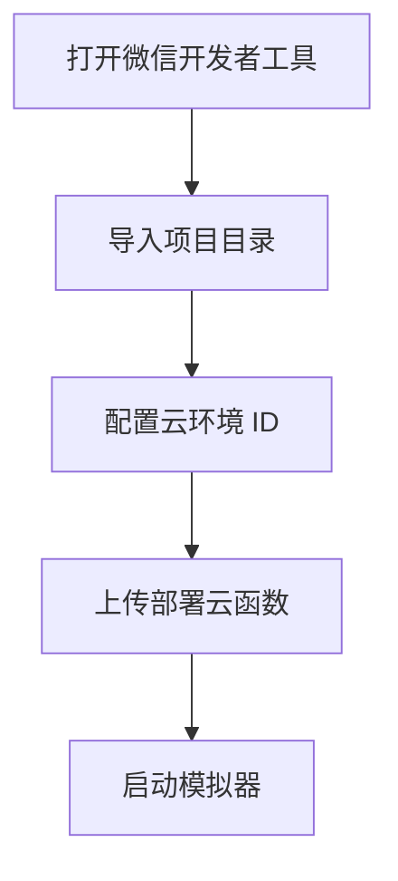

# 快速开始

## 前置条件
| 项目 | 版本/要求 |
| --- | --- |
| 微信开发者工具 | 建议最新版 |
| 小程序基础库 | 2.20.1+ |
| 云开发环境 | 已开通并配置环境 ID |

**Section sources**
- [project.config.json](file:///D:/WeChatProjects/miniprogram-1/project.config.json#L1-L85)
- [miniprogram/app.js](file:///D:/WeChatProjects/miniprogram-1/miniprogram/app.js#L1-L16)

## 初始化步骤

**Diagram sources**
- [project.config.json](file:///D:/WeChatProjects/miniprogram-1/project.config.json#L1-L85)

## 部署云函数
在开发者工具中，右键 `cloudfunctions/quickstartFunctions` → “上传并部署-云端安装依赖”。

**Section sources**
- [AGENTS.md](file:///D:/WeChatProjects/miniprogram-1/AGENTS.md#L8-L20)

## 运行与联机体验
1. 进入“联机对战”页面，创建房间。
2. 系统提示邀请好友，分享房间链接。
3. 好友打开链接后直接加入房间。
4. 对局中可听到自己/对手不同落子音效。

**Section sources**
- [miniprogram/pages/online/index.js](file:///D:/WeChatProjects/miniprogram-1/miniprogram/pages/online/index.js#L120-L260)
- [miniprogram/pages/gomoku/index.js](file:///D:/WeChatProjects/miniprogram-1/miniprogram/pages/gomoku/index.js#L1-L260)

## 常见问题
- **加入房间失败**：请确保云函数已重新部署，并使用新房间测试。
- **房间数据异常**：可调用 `repairRooms` 修复历史数据。

**Section sources**
- [cloudfunctions/quickstartFunctions/index.js](file:///D:/WeChatProjects/miniprogram-1/cloudfunctions/quickstartFunctions/index.js#L560-L700)

## 相关文档
- [项目首页](index.md)
- [架构总览](architecture.md)
- [文档关系图](doc-map.md)

*由 [Mini-Wiki v3.0.6](https://github.com/trsoliu/mini-wiki) 自动生成 | 2026-01-31T22:09:13.0084447+08:00*