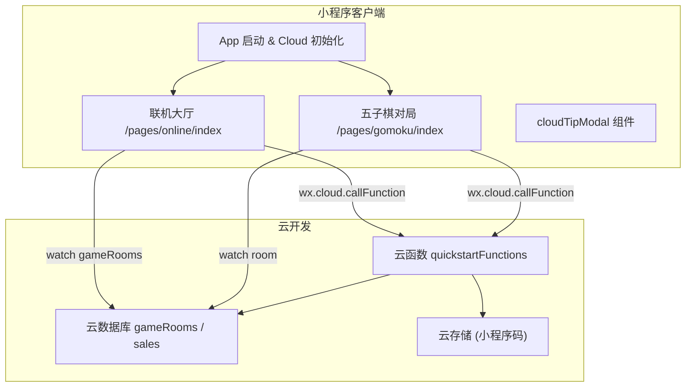
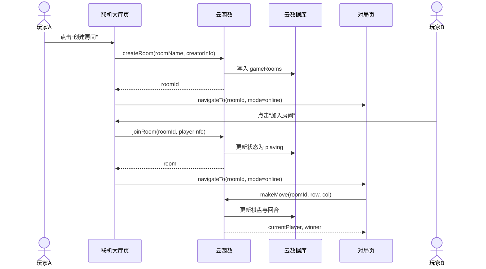
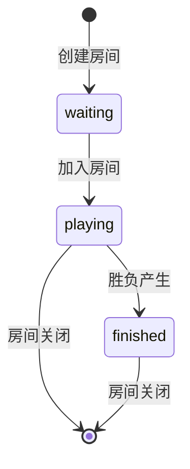

# 项目 Wiki

> WeChat 小程序联机五子棋项目的专业级文档索引与总览。本文档由 Mini-Wiki 自动生成。

## 项目概述
本项目是一个基于微信小程序与云开发能力构建的联机五子棋示例。客户端由小程序页面与组件组成，负责用户交互、棋盘渲染与对局控制；服务端由云函数统一处理房间创建、加入、落子、胜负判定与房间关闭等逻辑。

项目在 App 启动时初始化云能力环境，使前端可以通过 `wx.cloud.callFunction` 和数据库实时监听调用云端资源。联机大厅页面提供房间列表、创建与加入流程；对局页面支持本地与联机两种模式，并通过实时监听同步棋局状态。

同时，云函数内包含示例数据集合（`sales`）的增删改查逻辑，便于演示数据库基础能力。整体架构属于小程序前端 + 云函数 + 云数据库的全栈形态。

**Section sources**
- [README.md](file:///D:/WeChatProjects/miniprogram-1/README.md#L1-L6)
- [miniprogram/app.js](file:///D:/WeChatProjects/miniprogram-1/miniprogram/app.js#L1-L16)
- [miniprogram/app.json](file:///D:/WeChatProjects/miniprogram-1/miniprogram/app.json#L1-L16)
- [cloudfunctions/quickstartFunctions/index.js](file:///D:/WeChatProjects/miniprogram-1/cloudfunctions/quickstartFunctions/index.js#L1-L559)

## 架构预览

**Diagram sources**
- [miniprogram/app.js](file:///D:/WeChatProjects/miniprogram-1/miniprogram/app.js#L1-L16)
- [miniprogram/pages/online/index.js](file:///D:/WeChatProjects/miniprogram-1/miniprogram/pages/online/index.js#L51-L276)
- [miniprogram/pages/gomoku/index.js](file:///D:/WeChatProjects/miniprogram-1/miniprogram/pages/gomoku/index.js#L56-L331)
- [cloudfunctions/quickstartFunctions/index.js](file:///D:/WeChatProjects/miniprogram-1/cloudfunctions/quickstartFunctions/index.js#L1-L559)

**Section sources**
- [miniprogram/app.js](file:///D:/WeChatProjects/miniprogram-1/miniprogram/app.js#L1-L16)
- [miniprogram/pages/online/index.js](file:///D:/WeChatProjects/miniprogram-1/miniprogram/pages/online/index.js#L1-L329)
- [miniprogram/pages/gomoku/index.js](file:///D:/WeChatProjects/miniprogram-1/miniprogram/pages/gomoku/index.js#L1-L425)
- [cloudfunctions/quickstartFunctions/index.js](file:///D:/WeChatProjects/miniprogram-1/cloudfunctions/quickstartFunctions/index.js#L1-L559)

## 关键交互流程（创建房间 → 加入 → 落子）

**Diagram sources**
- [miniprogram/pages/online/index.js](file:///D:/WeChatProjects/miniprogram-1/miniprogram/pages/online/index.js#L128-L246)
- [miniprogram/pages/gomoku/index.js](file:///D:/WeChatProjects/miniprogram-1/miniprogram/pages/gomoku/index.js#L268-L331)
- [cloudfunctions/quickstartFunctions/index.js](file:///D:/WeChatProjects/miniprogram-1/cloudfunctions/quickstartFunctions/index.js#L165-L345)

**Section sources**
- [miniprogram/pages/online/index.js](file:///D:/WeChatProjects/miniprogram-1/miniprogram/pages/online/index.js#L128-L246)
- [miniprogram/pages/gomoku/index.js](file:///D:/WeChatProjects/miniprogram-1/miniprogram/pages/gomoku/index.js#L56-L331)
- [cloudfunctions/quickstartFunctions/index.js](file:///D:/WeChatProjects/miniprogram-1/cloudfunctions/quickstartFunctions/index.js#L165-L345)

## 房间状态与对局阶段

**Diagram sources**
- [cloudfunctions/quickstartFunctions/index.js](file:///D:/WeChatProjects/miniprogram-1/cloudfunctions/quickstartFunctions/index.js#L165-L523)

**Section sources**
- [cloudfunctions/quickstartFunctions/index.js](file:///D:/WeChatProjects/miniprogram-1/cloudfunctions/quickstartFunctions/index.js#L165-L523)

## 文档导航
| 文档 | 受众 | 解决的问题 |
| --- | --- | --- |
| [架构总览](architecture.md) | 架构评审、全体开发 | 理解系统边界、模块依赖与数据流 |
| [快速开始](getting-started.md) | 新成员、评估者 | 如何本地运行与在开发者工具调试 |
| [文档关系图](doc-map.md) | 文档读者 | 查找阅读路径与关联模块 |
| [客户端小程序域](客户端小程序/_index.md) | 前端开发 | 页面/组件组织与交互细节 |
| [云函数与数据域](云函数与数据/_index.md) | 后端/云开发 | 云函数 API 与数据模型 |
| [配置与环境域](配置与环境/_index.md) | 全体开发 | 构建配置、环境变量与部署约束 |
| [API 参考](api/quickstartFunctions.md) | 开发者 | 云函数事件类型与参数说明 |

**Section sources**
- [project.config.json](file:///D:/WeChatProjects/miniprogram-1/project.config.json#L1-L85)
- [cloudfunctions/quickstartFunctions/index.js](file:///D:/WeChatProjects/miniprogram-1/cloudfunctions/quickstartFunctions/index.js#L1-L559)
- [miniprogram/pages/online/index.js](file:///D:/WeChatProjects/miniprogram-1/miniprogram/pages/online/index.js#L1-L329)
- [miniprogram/pages/gomoku/index.js](file:///D:/WeChatProjects/miniprogram-1/miniprogram/pages/gomoku/index.js#L1-L425)

## 核心特性
| 特性 | 描述 | 关键实现 |
| --- | --- | --- |
| 房间管理 | 创建、加入、清空、关闭房间 | `createRoom` / `joinRoom` / `clearAllRooms` / `closeRoom` |
| 实时同步 | 列表与对局状态实时更新 | 数据库 `watch` 监听 + 失败重试 |
| 对局逻辑 | 15x15 棋盘、胜负判定 | 客户端与云端双端判定函数 |
| 本地模式 | 单机模式快速体验 | `initLocalGame` 初始化空棋盘 |
| 示例数据 | `sales` 集合 CRUD 示例 | `createCollection` 等操作 |

**Section sources**
- [miniprogram/pages/online/index.js](file:///D:/WeChatProjects/miniprogram-1/miniprogram/pages/online/index.js#L51-L312)
- [miniprogram/pages/gomoku/index.js](file:///D:/WeChatProjects/miniprogram-1/miniprogram/pages/gomoku/index.js#L45-L364)
- [cloudfunctions/quickstartFunctions/index.js](file:///D:/WeChatProjects/miniprogram-1/cloudfunctions/quickstartFunctions/index.js#L47-L559)

## 快速开始
### 创建并进入联机房间 [📄](file:///D:/WeChatProjects/miniprogram-1/miniprogram/pages/online/index.js#L128-L175)
```javascript
// 假设在 pages/online/index.js 中触发
wx.showLoading({ title: '创建房间中...' });

const result = await wx.cloud.callFunction({
  name: 'quickstartFunctions',
  data: {
    type: 'createRoom',
    roomName: '好友对战',
    creatorInfo: this.data.userInfo
  }
});

wx.hideLoading();
if (result.result.success) {
  wx.navigateTo({
    url: `/pages/gomoku/index?roomId=${result.result.roomId}&mode=online`
  });
}

// 期望输出：页面跳转到对局页，云端生成 roomId，并进入“等待对手”状态。
```

### 本地模式初始化棋盘 [📄](file:///D:/WeChatProjects/miniprogram-1/miniprogram/pages/gomoku/index.js#L45-L53)
```javascript
const boardSize = this.data.boardSize;
const board = Array(boardSize).fill(null).map(() => Array(boardSize).fill(''));
this.setData({
  board,
  currentPlayer: 'black',
  winner: null,
  canPlay: true
});

// 期望输出：15x15 空棋盘，当前玩家为黑棋，可直接落子。
```

**Section sources**
- [miniprogram/pages/online/index.js](file:///D:/WeChatProjects/miniprogram-1/miniprogram/pages/online/index.js#L128-L175)
- [miniprogram/pages/gomoku/index.js](file:///D:/WeChatProjects/miniprogram-1/miniprogram/pages/gomoku/index.js#L45-L53)

## 项目统计
| 指标 | 数值 | 说明 |
| --- | --- | --- |
| 页面数量 | 2 | `online`、`gomoku` 两个核心页面 |
| 组件数量 | 1 | `cloudTipModal` 提示弹窗 |
| 云函数 | 1 | `quickstartFunctions` 统一入口 |
| 数据集合 | 2 | `gameRooms`、`sales` |
| 棋盘大小 | 15x15 | 客户端与云端一致 |
| 实时监听 | 2 处 | 房间列表与房间状态监听 |

**Section sources**
- [miniprogram/app.json](file:///D:/WeChatProjects/miniprogram-1/miniprogram/app.json#L1-L16)
- [miniprogram/pages/online/index.js](file:///D:/WeChatProjects/miniprogram-1/miniprogram/pages/online/index.js#L1-L329)
- [miniprogram/pages/gomoku/index.js](file:///D:/WeChatProjects/miniprogram-1/miniprogram/pages/gomoku/index.js#L1-L425)
- [cloudfunctions/quickstartFunctions/index.js](file:///D:/WeChatProjects/miniprogram-1/cloudfunctions/quickstartFunctions/index.js#L1-L559)
- [cloudfunctions/quickstartFunctions/package.json](file:///D:/WeChatProjects/miniprogram-1/cloudfunctions/quickstartFunctions/package.json#L1-L14)

## 模块总览
| 业务域 | 模块 | 角色 | 文档 |
| --- | --- | --- | --- |
| 客户端小程序 | 应用初始化 | core | 客户端小程序/应用初始化/应用初始化.md |
| 客户端小程序 | 联机大厅 | core | 客户端小程序/联机大厅/联机大厅.md |
| 客户端小程序 | 五子棋对局 | core | 客户端小程序/五子棋对局/五子棋对局.md |
| 客户端小程序 | 提示弹窗组件 | util | 客户端小程序/组件库/提示弹窗组件.md |
| 云函数与数据 | quickstartFunctions | core | 云函数与数据/云函数网关/quickstartFunctions.md |
| 云函数与数据 | 数据模型 | core | 云函数与数据/数据模型/gameRooms.md |
| 配置与环境 | 项目配置 | config | 配置与环境/项目配置/项目配置.md |

**Section sources**
- [miniprogram/app.js](file:///D:/WeChatProjects/miniprogram-1/miniprogram/app.js#L1-L16)
- [miniprogram/pages/online/index.js](file:///D:/WeChatProjects/miniprogram-1/miniprogram/pages/online/index.js#L1-L329)
- [miniprogram/pages/gomoku/index.js](file:///D:/WeChatProjects/miniprogram-1/miniprogram/pages/gomoku/index.js#L1-L425)
- [miniprogram/components/cloudTipModal/index.js](file:///D:/WeChatProjects/miniprogram-1/miniprogram/components/cloudTipModal/index.js#L1-L27)
- [cloudfunctions/quickstartFunctions/index.js](file:///D:/WeChatProjects/miniprogram-1/cloudfunctions/quickstartFunctions/index.js#L1-L559)
- [project.config.json](file:///D:/WeChatProjects/miniprogram-1/project.config.json#L1-L85)

## 生成与质量信息
- 生成时间：2026-01-31T17:19:38.0847103+08:00
- 质量标准：professional-v2
- 渐进式扫描：已触发（排除 node_modules 后仍有 61 个文件）
- 下一步：继续生成各业务域模块文档、API 参考与文档关系图

**Section sources**
- [project.config.json](file:///D:/WeChatProjects/miniprogram-1/project.config.json#L1-L85)

## 相关文档
- [架构总览](architecture.md)
- [快速开始](getting-started.md)
- [文档关系图](doc-map.md)

**Section sources**
- [project.config.json](file:///D:/WeChatProjects/miniprogram-1/project.config.json#L1-L85)

*由 [Mini-Wiki v3.0.6](https://github.com/trsoliu/mini-wiki) 自动生成 | 2026-01-31T17:19:38.0847103+08:00*
