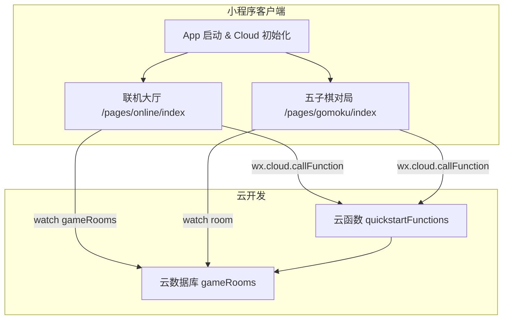
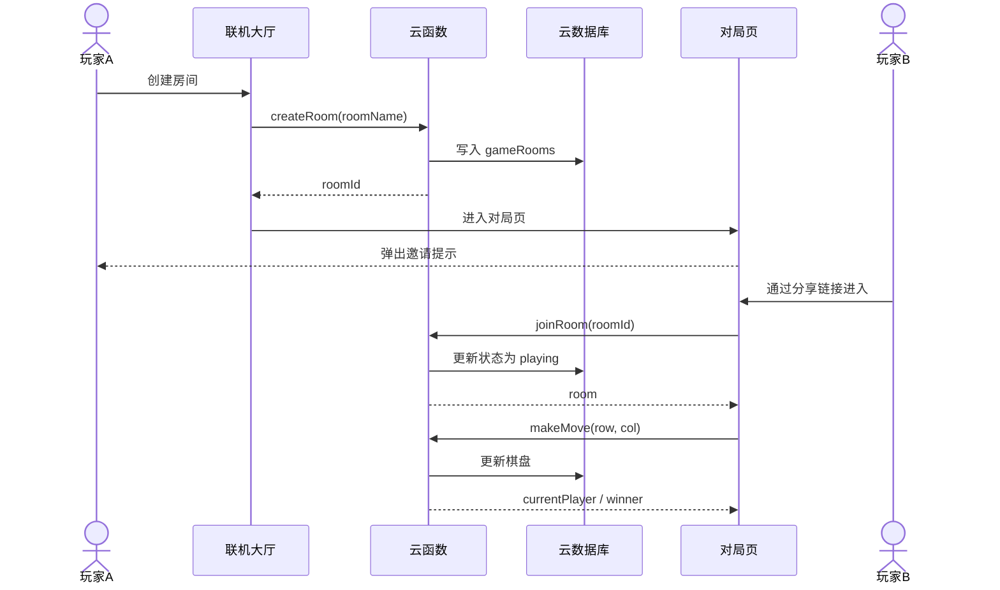
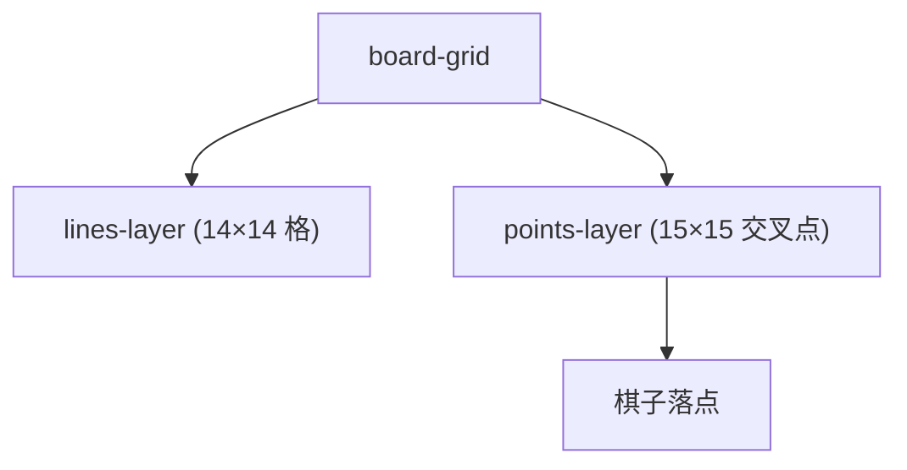

# 项目 Wiki

> WeChat 小程序联机五子棋项目的专业级文档索引与总览。本文档由 Mini-Wiki 自动生成。

## 项目概述
本项目是一个基于微信小程序与云开发能力构建的联机五子棋示例。客户端负责 UI 与交互流程，云函数作为后端网关封装核心业务逻辑，云数据库承担房间与棋盘状态的持久化与实时同步。

对局页面目前采用“**15×15 落子点（14×14 格）**”的交叉点模型：棋盘线为 15 条横线和 15 条竖线，棋子落在交叉点上，符合标准五子棋习惯。同时加入了星位（天元与四角星位）辅助定位，强化棋盘质感。

**Section sources**
- [miniprogram/pages/gomoku/index.js](file:///D:/WeChatProjects/miniprogram-1/miniprogram/pages/gomoku/index.js#L1-L200)
- [miniprogram/pages/gomoku/index.wxml](file:///D:/WeChatProjects/miniprogram-1/miniprogram/pages/gomoku/index.wxml#L1-L60)
- [miniprogram/pages/gomoku/index.wxss](file:///D:/WeChatProjects/miniprogram-1/miniprogram/pages/gomoku/index.wxss#L150-L330)
- [cloudfunctions/quickstartFunctions/index.js](file:///D:/WeChatProjects/miniprogram-1/cloudfunctions/quickstartFunctions/index.js#L1-L700)

## 最新能力与体验优化
- **交叉点落子**：棋子点击与落点对齐交叉点，保持 15×15 落子点标准。
- **房间邀请**：创建房间后可直接邀请好友加入，不必返回房间列表。
- **房间标题**：导航栏标题显示“房间：{房间名}”。
- **音效区分**：自己落子与对方落子使用不同音效。
- **数据修复**：云函数提供 `repairRooms`，修复历史房间 `whitePlayerInfo` 异常。

**Section sources**
- [miniprogram/pages/online/index.js](file:///D:/WeChatProjects/miniprogram-1/miniprogram/pages/online/index.js#L120-L330)
- [miniprogram/pages/gomoku/index.js](file:///D:/WeChatProjects/miniprogram-1/miniprogram/pages/gomoku/index.js#L1-L260)
- [cloudfunctions/quickstartFunctions/index.js](file:///D:/WeChatProjects/miniprogram-1/cloudfunctions/quickstartFunctions/index.js#L1-L700)

## 架构预览

**Diagram sources**
- [miniprogram/app.js](file:///D:/WeChatProjects/miniprogram-1/miniprogram/app.js#L1-L16)
- [miniprogram/pages/online/index.js](file:///D:/WeChatProjects/miniprogram-1/miniprogram/pages/online/index.js#L51-L120)
- [miniprogram/pages/gomoku/index.js](file:///D:/WeChatProjects/miniprogram-1/miniprogram/pages/gomoku/index.js#L1-L260)
- [cloudfunctions/quickstartFunctions/index.js](file:///D:/WeChatProjects/miniprogram-1/cloudfunctions/quickstartFunctions/index.js#L1-L700)

## 关键交互流程（创建 → 邀请 → 加入 → 落子）

**Diagram sources**
- [miniprogram/pages/online/index.js](file:///D:/WeChatProjects/miniprogram-1/miniprogram/pages/online/index.js#L120-L260)
- [miniprogram/pages/gomoku/index.js](file:///D:/WeChatProjects/miniprogram-1/miniprogram/pages/gomoku/index.js#L1-L260)
- [cloudfunctions/quickstartFunctions/index.js](file:///D:/WeChatProjects/miniprogram-1/cloudfunctions/quickstartFunctions/index.js#L160-L560)

## 棋盘渲染结构

**Diagram sources**
- [miniprogram/pages/gomoku/index.wxml](file:///D:/WeChatProjects/miniprogram-1/miniprogram/pages/gomoku/index.wxml#L1-L70)
- [miniprogram/pages/gomoku/index.wxss](file:///D:/WeChatProjects/miniprogram-1/miniprogram/pages/gomoku/index.wxss#L150-L330)

## 文档导航
| 文档 | 受众 | 解决的问题 |
| --- | --- | --- |
| [架构总览](architecture.md) | 架构评审、全体开发 | 系统边界、模块依赖与数据流 |
| [快速开始](getting-started.md) | 新成员 | 本地运行、联机调试、云函数部署 |
| [文档关系图](doc-map.md) | 文档读者 | 阅读路径与依赖关系 |

**Section sources**
- [project.config.json](file:///D:/WeChatProjects/miniprogram-1/project.config.json#L1-L85)

## 核心特性
| 特性 | 描述 | 关键实现 |
| --- | --- | --- |
| 交叉点落子 | 15×15 落子点，14×14 格 | points-layer + boardSize 15 |
| 房间邀请 | 创建后直接邀请好友 | 分享链接携带 roomId |
| 音效区分 | 自己/对手不同音效 | place.wav / place-opponent.wav |
| 房间修复 | 修复历史字段异常 | repairRooms 云函数 |

**Section sources**
- [miniprogram/pages/gomoku/index.js](file:///D:/WeChatProjects/miniprogram-1/miniprogram/pages/gomoku/index.js#L1-L260)
- [miniprogram/assets/sounds/place.wav](file:///D:/WeChatProjects/miniprogram-1/miniprogram/assets/sounds/place.wav#L1-L1)
- [miniprogram/assets/sounds/place-opponent.wav](file:///D:/WeChatProjects/miniprogram-1/miniprogram/assets/sounds/place-opponent.wav#L1-L1)
- [cloudfunctions/quickstartFunctions/index.js](file:///D:/WeChatProjects/miniprogram-1/cloudfunctions/quickstartFunctions/index.js#L560-L700)

## 快速开始
```javascript
// 创建房间并进入对局
const result = await wx.cloud.callFunction({
  name: 'quickstartFunctions',
  data: { type: 'createRoom', roomName: '好友对战', creatorInfo: this.data.userInfo }
});
if (result.result.success) {
  wx.navigateTo({
    url: `/pages/gomoku/index?roomId=${result.result.roomId}&mode=online&roomName=${encodeURIComponent('好友对战')}&created=1`
  });
}
```

**Section sources**
- [miniprogram/pages/online/index.js](file:///D:/WeChatProjects/miniprogram-1/miniprogram/pages/online/index.js#L120-L180)

## 相关文档
- [架构总览](architecture.md)
- [快速开始](getting-started.md)
- [文档关系图](doc-map.md)

**Section sources**
- [project.config.json](file:///D:/WeChatProjects/miniprogram-1/project.config.json#L1-L85)

*由 [Mini-Wiki v3.0.6](https://github.com/trsoliu/mini-wiki) 自动生成 | 2026-01-31T22:09:13.0084447+08:00*